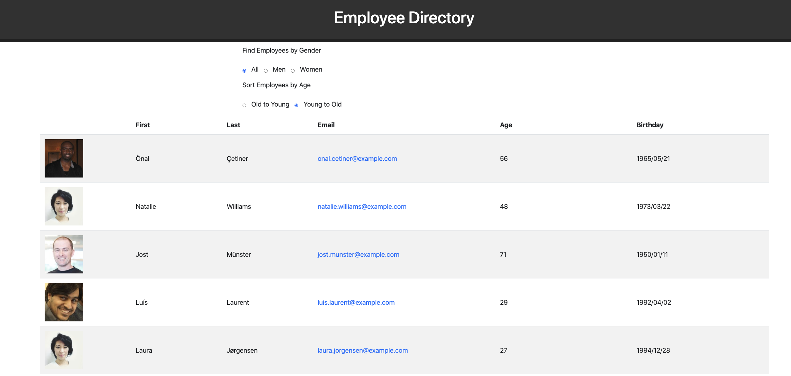

# ReactEmployeeDirectory
An employee directory utilizing React

## Directions
* Clone the git repository to the local machine. 

## Run 
* npm start
- This will launch the application in development mode. 
- The application will launch in your browser. 

## Deployment on GitHub
https://troylochner.github.io/ReactEmployeeDirectory/

## Future Improvements
- Would like to explore age range slider control. 
- Would like to add variable column sorting ability

## Application Home
